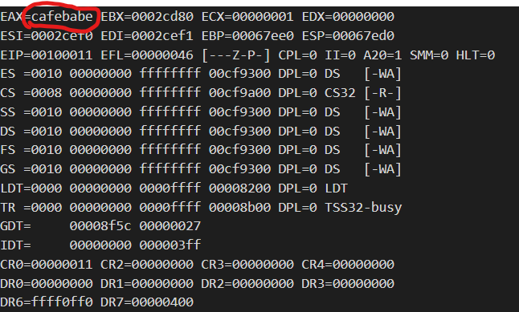
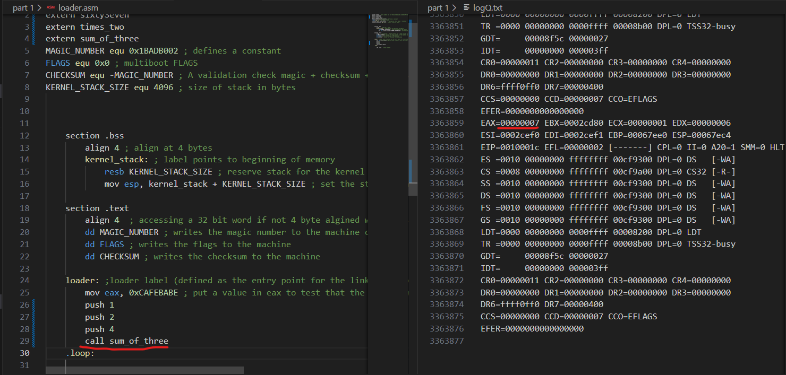
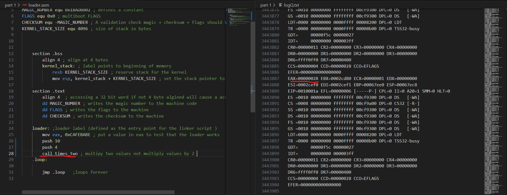
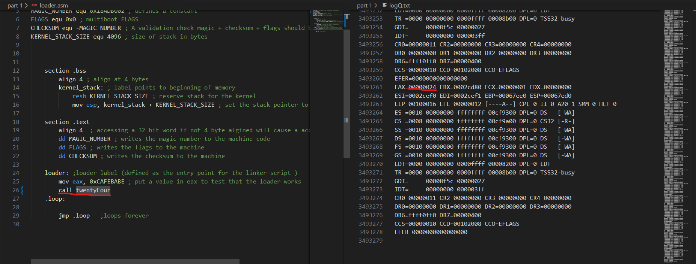

Required Software:
The File stage2_eltorito is a bootable CD-ROM that contains the GRUB Legacy bootloader.

### Workbook 2 Part 1

## Booting the OS
The aim of Task 1 is to boot the operating system and hand over control of the system to the kernel. To prove that the kernel has taken over, the command "mov eax, 0xCAFEBABE" shall be run, leaving a marker in the EAX register.

By installing the source files for Workbook2 Part 1, the following file structure should be automatically populated.

## Creating the Kernel

Beginning with the kernel code, this file is responsible for the actions taken once the kernel has been given control and will later be used to give control to C programs for the ease of implementation of larger projects. As such, this file contains an entry point for the linker script, a loop function, and a function labelled with loader containing code to be run after POST.

The Linker Script is highly important as it is responsible for placing the kernel code and data from the program into memory so it can be executed by the CPU. The link.ld marks the start point of the kernel in memory as the address 0x00100000, which is 1 MB into memory. This address is directly after the bootloader and BIOS, and thus prevents overriding previous functionality. All data and code from assembly files are then aligned at 4KB, creating a standard for how to store these assembly sections in memory and preventing exceptions when accessing data as large as 32 bits. This file is then linked with the compiled kernel code, creating the kernel in ELF (Executable and Linkable Format).

## Initialising GRUB Legacy
Bootloaders are loaded after BIOS POST and are responsible for loading the operating system into memory, setting up registers and stacks and then initialising the kernel. I used GRUB Legacy provided by UWE Bristol. This is used to create an ISO image, a file that mimics a CD-ROM, that can be used to create an instance of an operating system. The ISO image is connected to the compiled linker script and kernel code in a separate lst file.

## Implementing the Stack
In order to be able to store values and C functions for later use, the stack must be implemented. The stack is a Last In First Out data structure where data is "pushed" on the top of the stack and can be "popped" off the first position of the stack. The stack is vital for the implementation of C functionality as it stores the order of the calls and local parameters needed for these functions. In the kernel loader file, 4096 bytes are reserved at run time, and the ESP register is set to the top value of the stack such that the stack can be used.

## Emulating the Operating System
Using QEMU (Quick Emulator), the ISO image can be booted. In order to determine if the kernel was successfully executed, key registers were logged during runtime in a file called logQ.txt. As can be seen below, 0xCAFEBABE has been assigned to the EAX register, thus completing the booting stage of the OS, allowing for future functionality to be added in C. 

## Adding C functionality
Now that the kernel has taken control, compiled C functions can be called from within the kernel code file. This can be done by combining a compiled C file with the linker file. The file kmain.c has functions inside that can be called in the assembly with the extern directive. Here is an example of each function and its output:

### Sum Of Three
Sum of Three is a function that takes three integer arguments and sums them together. The arguments are pushed onto the stack in assembly from where they are popped and used in the calculation. The result is then placed into the EAX register:

### Times Two
Times Two is a function that takes two integer arguments and multiplies one by the other. Like in the Sum Of Three function, the arguments are pushed onto the stack with assembly code and popped in the C function. The result is also placed into the EAX register:

### Twenty Four
Being my lucky number, this is a function that outputs the value 36 to the EAX. This also highlights that the registers are output in the form of hexadecimal, and as such, the decimal value must be converted to the hexadecimal version. (24 Hex = 2*16 + 4 = 36 Den). 

## The Framebuffer
Up until this point, QEMU has been creating a blank VGA terminal screen while the operating system is booted and running. Through the implementation of a Framebuffer, functions and text can be displayed on the screen. The framebuffer contains all the information on what should be displayed on the 80 x 25 VGA display provided by QEMU. fb is a pointer to a section of memory starting at the memory address 0x000B8000 or 753664 in denary. It holds 2 bytes for the grid values for the display. Each grid value has both a byte storing the character to be displayed and a byte storing the style values for the background color and foreground color combined into a byte. For example, fb[0] holds the char value "a", and therefore fb[1] holds the number 0x4F, which corresponds to foreground red (4 or 0x4) and background white (15 or 0xF). QEMU is responsible for emulating the VGA display hardware. VGA provides a text-based display of an 80 x 25 grid. It reads the section of memory that stores the framebuffer and displays the data. As another note, this code now uses the Curses terminal library to assist with the creation of the text-based display.

## Writing to the framebuffer 
The function, fb_write(), contains the code for writing to the framebuffer. It takes a char pointer containing the address to the start of a message to output and the length of the message as arguments. It then retrieves the current position of the Cursor by combining the high and low registers from the VGA. One by one, the algorithm iterates through the message, writing both the character and style settings to the framebuffer. As it does this, it increments the cursor to prevent writing over the new character. Meanwhile, the changes to the framebuffer can be seen as the VGA outputs the framebuffer, resulting in the message being written to the screen.

## Interacting with the VGA Cursor
The VGA has a hardware cursor that is made from two registers, the high byte and the low byte. In order to update and display from the framebuffer, the program must have a method to interact with this cursor. This can be done through the I/O ports Command Port (0x3D4) and Data Port (0x3D5). The Command port is used to select the register from VGA to send data to, and the Data Port holds the data to be sent. Thus, the program is able to select the high byte and low byte registers and send data to them.
This is usually done through assembly instruction *out*; however, the file io.s and io.h provide the function and the interface from which framebuffer.c can call, instead of running the assembly code directly. If the framebuffer wants to move the cursor, the fb_move_cursor() function is called. This function takes a framebuffer position and converts it into a high byte and a low byte such that the VGA Cursor is able to store it.

# Workbook 2 Part 2

## Part 1 Display Keyboard Input
## Interrupts
In order for the keyboard and other devices to be able to interact with the operating system, a method for interrupt handling must be created. Interrupts are signals sent by devices to request immediate attention from the operating system. A Programmable Interrupt Controller is responsible for acknowledging these interrupts and preventing interrupt conflicts. The IDT, or Interrupt Descriptor Table, contains how to respond to any of the up to 256 interrupts. (starting 0 - 255) 

## Displaying Keyboard Input
When a key is pressed on the keyboard, that key's scan code is written to the keyboard data port. (0x60) Meanwhile, a keyboard interrupt request, also known as the IRQ1, is sent directly to the PIC, which causes a jump to the interrupt_asm.s file. Common_interrupt_handler pushes all the local registers onto the stack such that the current process can be returned to after handling the interrupt. Then interrupt_handler is called, passing in the interrupt number as an argument, which in this case is 33. Inside the interrupt. In the C file, the interrupt_handler function compares the interrupt code and finds the match to the keyboard handling code. The keyboard scan code is read from the Keyboard Data Port and then converted into the ASCII value of the key pressed. If it is not a special case character, such as backspace or the enter key, then it outputs the ASCII value to the framebuffer.

## Special Case Inputs
When either of the following keys are pressed, a different function will run instead of outputting the value:

# Enter: Moving to a new Line
A simple function that creates a new line with the Os prompt. When the enter key is pressed, fb_new_line() is called. fb_new_line stores the position of the Cursor and then divides it by 80. This removes the specific column that the Cursor was in and returns only the row number. It increments this row number and calls fb_move(). fb_move() differs from fb_move_cursor() as it takes an X and a Y value, which correspond to the grid position of the display. It converts this value into a cursor position and moves the Cursor to that index. After moving the index to the next line, fb_new_line() writes the OS prompt.

# Backspace: Remove the last character
A simple function that creates and deletes the last character written in the framebuffer and moves the Cursor back. When the backspace key is pressed, fb_backspace is called, before removing the character, it first checks that it will not be deleting the OS prompt. It does this by checking the position of the start of the line, combined with the offset of the OS prompt and the current position of the Cursor. If the position does not fall into the invalid range, the cursor is moved back one space and the character in its current position is deleted.

## Part 2 Input Buffer API

## Reading from the Terminal
getc() takes a grid position as an argument, which it multiplies by 2 to get the position of the grid inside the Framebuffer. It then returns this character.

Getc() works in tandem with the readline() function, which takes a given row and a char pointer that points to a given space in memory to store the line. It iterates through the row in the framebuffer using getc() to store the characters. If the algorithm reaches a newline or a null-terminated value, it will break from the for loop and null-terminate the string. It will also stop if it is about to iterate over to the next row. The line can then be accessed from within the function that called the readline function.

## Dynamic Buffer Bounds
When data is written past the framebuffer end, memory is at risk of being overridden. The function checkBounds is responsible for returning the framebuffer to a valid position. First, it checks the current position of the Cursor to determine if it is outside of the bounds of the framebuffer. If it is, it calls fb_shuffle(), a shuffling algorithm that moves every line of data up by one. fb_shuffle begins at row 1 instead of row 0 and reads the line. It then replaces the line above (in this case row 0) with the line just read. It continues this until it has reached the bottom row. This leaves the bottom two rows equal and as such the function iterates through the final row, deleting every character as it goes. It then outputs the os prompt on a new line.

## Part 3 Terminal Implementation
## Reading Commands
The Struct Command contains three variables: a pointer to the name of the command, a pointer to a function that returns an integer and the length of the command's name. The readCommand function is called directly from the interrupt_handler function when a new line is entered. This function reads the entire line, excluding the "myOS:" prompt and stores it into a character array called command. So long as the command is not an empty string the command is passed into the processCommand array where it is iterated through, checking to see if it is equal to any of the prewritten commands. When the processCommand function finds a match, it will call the function stored in the corresponding commands struct and then write a new line. If the command was not found, it will prompt the user and state that it was an unknown command.

The following screenshots show all the commands in action.

## Clear

## Color

## Version

## Invalid Commands

